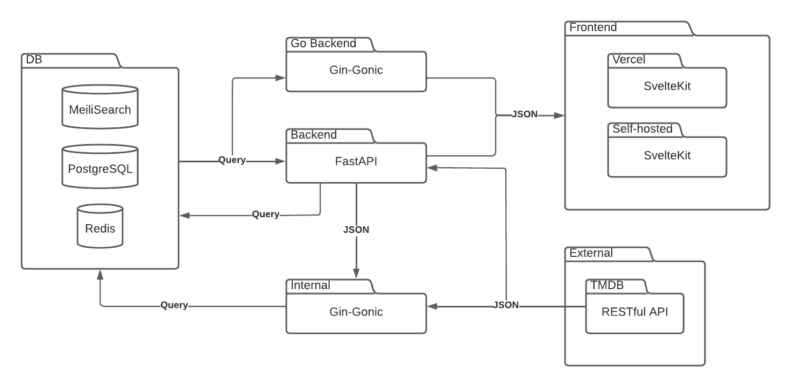

Streamchaser seeks to simplify movie, series and documentary search located on streaming services by curating all of the content through a centralized entertainment technology platform.
Streamchaser seeks to solve the issue where it appears, i.e. in front of the TV.
Lastly, Streamchaser is founded on the basis of convenience, which means that no feature,
no profit margin and no personal gains should ever compromise the convenience and ease of use for the customer.

## Core contributers 👷

- [AndreasPB](https://github.com/AndreasPB)
- [Pankai222](https://github.com/Pankai222)
- [nullxDEADBEEF](https://github.com/nullxDEADBEEF)
- [Primdahl26](https://github.com/Primdahl26)

## First time setup

Here's how to get the application up and running for development

### Prerequisites

- Got **Git** installed
- Got **Docker** installed

1. Clone the repo `git clone https://github.com/streamchaser/streamchaser.git`
2. Add `.env` in root and frontend/

- Root:
  - `HOST_NAME=localhost`
  - `APP_ENVIRONMENT=dev`
  - `TMDB_KEY=<get one from https://www.themoviedb.org/signup>`
- Frontend:
  - `VITE_API_PATH=http://api.localhost`
  - `VITE_GO_API_PATH=http://apiv2.localhost`

3. Build the container `docker-compose up --build -d`
4. Run `docker-compose exec slowpoke python3 cli.py full-setup --first-time --popularity <1-1000>`(the more the less amount of media)
5. Go to http://localhost/ and search
6. Optional: `docker-compose stop frontend && cd frontend && yarn dev` and go to http://localhost:3000 - Our workaround for hot-reloading

# CLI

To use the cronjob use the following in the terminal:
`docker-compose exec slowpoke python3 cli.py <command> <parameter>`

## The most used commands:

### `full-setup`

> The full setup with everything. Grabs the newest zipped file and populates PostgreSQL, then indexes MeiliSearch and redis with all the data used by the frontend.

Options:

- `--popularity FLOAT` [default: 1]
- `--first-time / --no-first-time` [default: no-first-time]

### `update-ids`

> Takes IDs in the format of m123 and t123 for movies and tv-series respectively. Is able to take multiple IDs seperated by spaces.

Arguments:

- IDS... [required]

### `update-media`

> Sends media ids to our internal update-media endpoint in chunks. --first-time uses ids from a zipped file, --no-first-time uses recently changed media.

Options:

- `--chunk-size INTEGER` [default: 1000]
- `--first-time / --no-first-time` [default: no-first-time]
- `--popularity FLOAT` [default: 1]

## Use --help

To get the full list of commands type:

- `docker-compose exec slowpoke python3 cli.py --help`

or to get help with a command:

- `docker-compose exec slowpoke python3 cli.py <command> --help`

# Our tech stack

# Credits

**Thanks to all the great frameworks and tools!**

Frontend:

- [Svelte](https://github.com/sveltejs/svelte)
- [Svelte-kit](https://kit.svelte.dev)
- [Tailwind CSS](https://tailwindcss.com)
- [DaisyUI](https://daisyui.com)

Backend:

- [FastAPI](https://github.com/tiangolo/fastapi)
- [SQLAlchemy](https://www.sqlalchemy.org)
- [Gin Gonic](https://gin-gonic.com)
- [GORM](https://gorm.io)

Databases:

- [MeiliSearch](https://github.com/meilisearch/MeiliSearch)
- [PostgreSQL](https://github.com/postgres/postgres)
- [Redis](https://redis.com)

DevOps:

- [Docker](https://github.com/docker)
